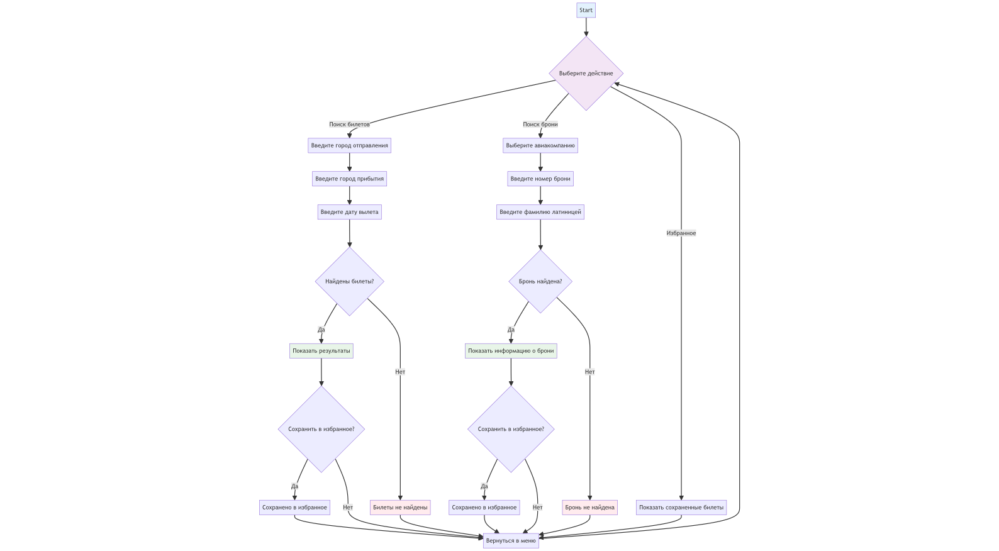

## Описание проекта: 
Бот, с помощью которого пользователи могут искать билеты, брони по ним, отслеживать понравившиеся билеты

## Что видит пользователь: 
Пользователь видит простой интерфейс привычного мессенджера. Пользователь может найти интересующий билет по месту отправления, прибытия и дате, а также найти информацию по заранее забронированному билету. 

Главное меню содержит приветственное сообщение и кнопки основных действий: поиск билетов, поиск брони и избранное. 

При процессе поиска билетов от пользователя будут запрошены данные о месте прибытия, месте отправления и дате вылета, также будут даны подсказки по формату ввода. После ввода требуемой информации пользователь увидит список билетов с информацией о маршруте, дате и времени, номере рейса и стоимости билета, если такой будет найден, или плашку «Билет не найден» в ином случае. У пользователя также есть функции на выбор: вернуться в главное меню, добавить билет в избранное.

## Поиск бронирований

Здесь мы рассматриваем разные случаи для реализации функции бронирования билета:

1. При процессе поиска брони от пользователя будет запрошен номер брони (PNR), фамилия латиницей. Если бронь найдена, то пользователь получит данные о рейсе: дата и время вылета, номер рейса. Если бронь не найдена, то отображается плашка «Бронь не найдена» и предлагается вернуться на главное меню. Какие с этим могут быть проблемы? PNR и фамилия - это конфиденциальная информация, нет уверенности в том, что достать эти данные с помощью API возможно. Можно использовать парсинг, но он работает медленнее и не приспособлен к изменениям структуры сайтов. 
2. Также можем запрашивать у пользователя название авиакомпании и PNR, хранить ссылки для проверки брони, подставлять в ссылку нужной авиакомпании PNR, и выдавать пользователю ссылку на его бронирование, но тогда мы будем работать с ограниченным списком авиакомпаний.
3. Пользователь может просматривать информацию о билетах и добавлять их в «Избранное», куда у него будет доступ в любое время. То есть он как бы хранит свои брони и может быстро узнать информацию о выбранных рейсах, нам не нужен будет доступ ни к какой конфиденциальной информации. При активации кнопки «Избранное» пользователь увидит информацию об отслеживаемых им билетах.

Ниже представлена схема:

Далее будут описаны задачи необходимые для выполнения, их распределение среди участников команды и предполагаемое время на их выполнения

**Участник №1** (Амирзянова Камила) - ответственный за получение данных о билетах:
- Изучить и подобрать подходящие API (2 - 3 часа)
- Создать класс для работы с разными API (3 - 4 часа)
- Написать функцию для поиска авиабилетов и парсер для преобразования результатов в нужный формат (3 - 4 часа)
- Сделать систему обработок ошибок (2 - 3 часа)

**Участник №2** (Леденева Дарья) - ответственный за логику работы бота и его интерфейс:
- Создать файл с основным кодом бота и настроить базовые команды (2 - 3 часа)
- Спроектировать интерфейс с кнопками и написать функцию, реагирующую на нажатие этих кнопок, реализовать логику для каждой кнопки (5 - 6 часов)
- Сделать шаблоны сообщений для красивого вывода (1 - 2 часа)

**Участник №3** (Смирнова Мария) - ответственный за работу с базами данных:
- Выбрать тип БД, спроектировать таблицы пользователей и запросов (2 - 3 часа)
- Написать функции для работы с БД: добавить пользователя, сохранить запрос пользователя (4 - 6 часов)
- Интегрировать с основным кодом бота (2 - 3 часа)